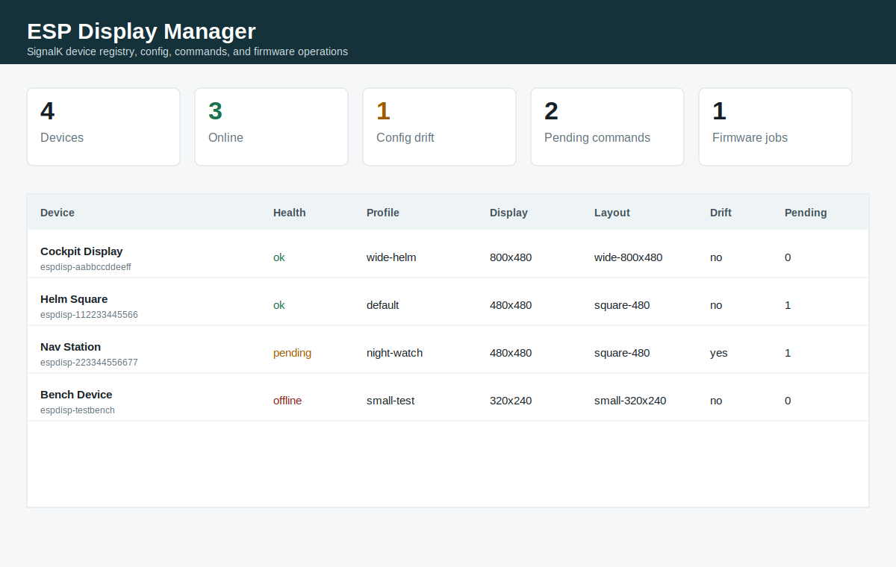
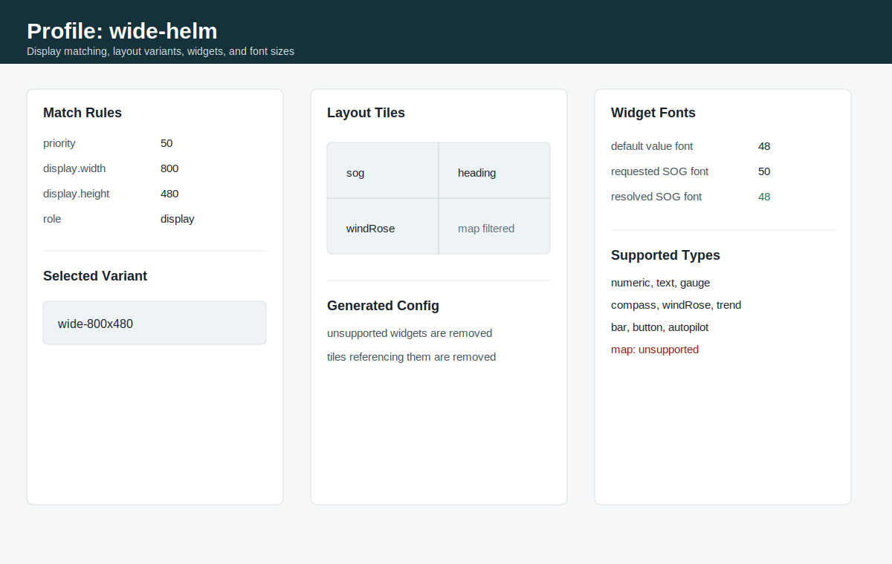

# SignalK ESP Display Manager

The `espdisp-manager` plugin is the SignalK-side control plane for ESP display
devices. It manages device registration, configuration, command delivery,
display/layout variants, widget settings, firmware metadata, and OTA jobs.

## Concepts

```text
Device
  A physical ESP display. It reports identity, firmware, display geometry,
  touch support, widget support, font support, current UI state, and health.

Profile
  A reusable configuration bundle. Profiles can match a device by board,
  display size, role, location, or capability flags.

Generated Config
  The per-device config emitted by the plugin after merging profile defaults,
  per-device overrides, display variant selection, widget filtering, and font
  size resolution.

Command
  A queued action for one device. Devices poll, execute, then acknowledge.

Group
  A dynamic set of devices. Current groups are derived from role, location,
  and the built-in all group.

Firmware Artifact
  Vendor-aware firmware metadata plus optional binary storage information.

Firmware Job
  A firmware update request that creates a firmware.update command and tracks
  progress through confirmation.
```

## Screenshots

Device overview concept:



Profile and widget concept:



## Device Lifecycle

```text
1. Device discovers SignalK and the espdisp-manager plugin.
2. Device registers with identity, display geometry, and capabilities.
3. Plugin assigns an explicit or auto-matched profile.
4. Device fetches generated config.
5. Device applies config and reports status/heartbeat.
6. Plugin queues commands.
7. Device polls, executes, and acknowledges commands.
8. Firmware jobs use the same command/progress/confirm loop.
```

## Implemented Plugin Surface

Base path:

```text
/plugins/espdisp-manager
```

Discovery and capabilities:

```text
GET  /.well-known/espdisp-management
GET  /capabilities
GET  /dashboard
GET  /ui
```

Registry:

```text
GET    /devices
POST   /devices/register
GET    /devices/:id
PATCH  /devices/:id
POST   /devices/:id/status
GET    /devices/:id/config
GET    /devices/:id/auth/status
```

Profiles and groups:

```text
GET  /profiles
POST /profiles
POST /devices/:id/profile
GET  /groups
POST /groups/:groupId/command
```

Commands:

```text
POST /devices/:id/command
GET  /devices/:id/commands
GET  /devices/:id/commands/:commandId
POST /devices/:id/commands/:commandId/ack
POST /devices/:id/commands/:commandId/cancel
POST /automation/event
```

Provisioning and tokens:

```text
GET  /provisioning/tokens
POST /provisioning/tokens
POST /devices/:id/tokens/rotate
POST /devices/:id/tokens/revoke
```

Firmware:

```text
GET  /firmware/catalog
POST /firmware/artifacts
GET  /firmware/artifacts/:artifactId
GET  /firmware/download/:jobId
GET  /devices/:id/firmware/jobs
POST /devices/:id/firmware/jobs
GET  /devices/:id/firmware/jobs/:jobId
POST /devices/:id/firmware/jobs/:jobId/progress
POST /devices/:id/firmware/confirm
```

## Auth

SignalK protects plugin HTTP routes with normal SignalK auth:

```text
Authorization: Bearer <signalk-token>
```

Device-level auth is carried separately:

```text
X-EspDisp-Authorization: Bearer <device-token>
```

The local test fixture uses:

```text
username: admin
password: admin
device token: espdisp-dev
```

## Display And Widget Configuration

Devices register display geometry:

```json
{
  "display": {
    "width": 480,
    "height": 480,
    "rotation": 0,
    "colorDepth": 16,
    "shape": "square"
  }
}
```

Profiles can match by geometry:

```json
{
  "id": "wide-helm",
  "priority": 50,
  "match": {
    "display": {
      "width": 800,
      "height": 480
    }
  }
}
```

Profiles can include layout and widget variants. The plugin sends only the
selected variant and filters unsupported widgets before the device sees the
config.

Font sizes are resolved against the device-reported supported font sizes. If a
profile requests `50` and the device supports `[12, 24, 48]`, the generated
config uses `48`.

## Dashboard API

`GET /dashboard` returns an operator summary:

```json
{
  "counts": {
    "devices": 2,
    "online": 1,
    "offline": 1,
    "configDrift": 1,
    "pendingCommands": 3
  },
  "devices": [
    {
      "id": "espdisp-aabbccddeeff",
      "health": "ok",
      "profile": "default",
      "display": {
        "width": 480,
        "height": 480
      },
      "desiredConfig": {
        "layoutVariant": "square-480",
        "widgetVariant": "square-480"
      }
    }
  ]
}
```

`GET /ui` renders a lightweight HTML operator view backed by the same dashboard
data. It is intentionally simple and server-rendered; a richer SignalK webapp
can replace it later without changing the API.

## Test Commands

Run plugin tests:

```sh
npm test --prefix signalk/plugins/signalk-espdisp-manager
```

Run future firmware contract tests in skip mode:

```sh
pytest tests/system/unattended/test_espdisp_manager_contract.py -q
```

Run firmware contract tests against a real device once firmware support exists:

```sh
ESPDISP_MANAGER_CONTRACT=1 \
ESPDISP_HOST=<device-ip> \
SIGNALK_URL=http://localhost:3000 \
pytest tests/system/unattended/test_espdisp_manager_contract.py
```
